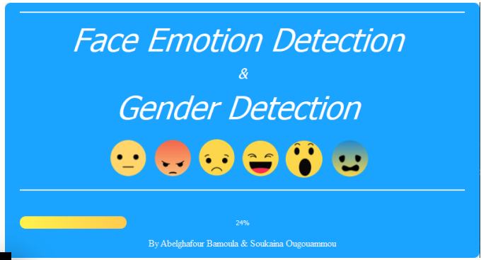
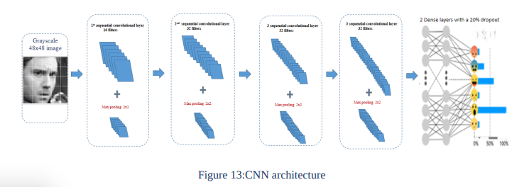
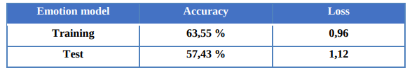
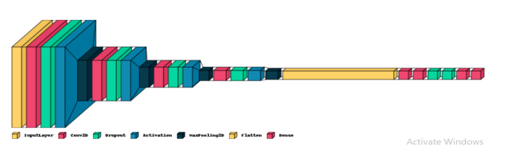
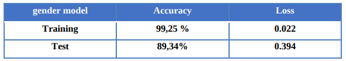
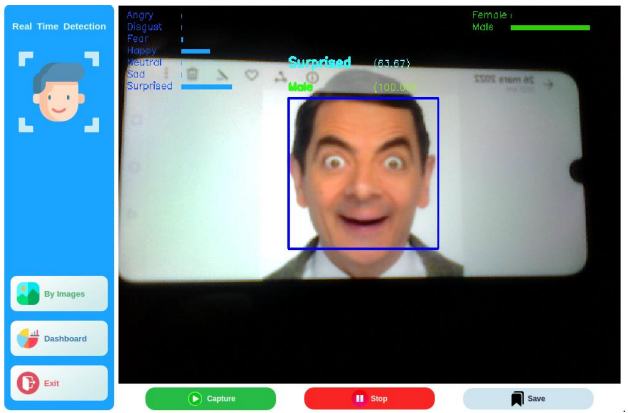
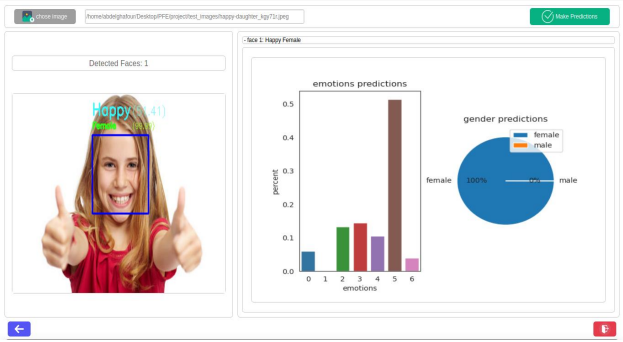

# PFE
#### end of studies project

in our case of study, we applied some deep learning algorithms such as CNN to
extract features from images in order to analyses and classify gender and facial
expressions from both static images and videos to reveal information on one's
emotional state. 

#### Emotion model
- emotion dataset : The FER 2013 dataset is well known and was used in the Kaggle competition. The data consists of
48x48 pixel grayscale images of faces.

#### Gender model
- dender dataset : The UTKFace dataset is a large-scale face dataset with long age span (range from 0 to 116
years old). The dataset consists of over 20,000 face images with annotations of age, gender, and
ethnicity.

#### - The Aplication

